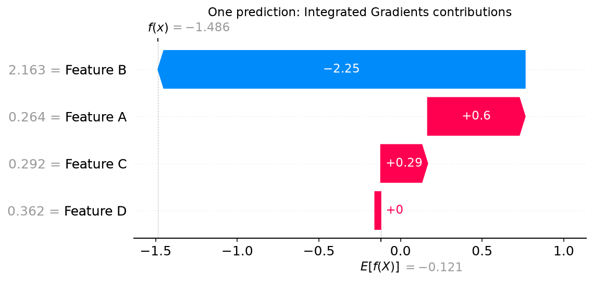
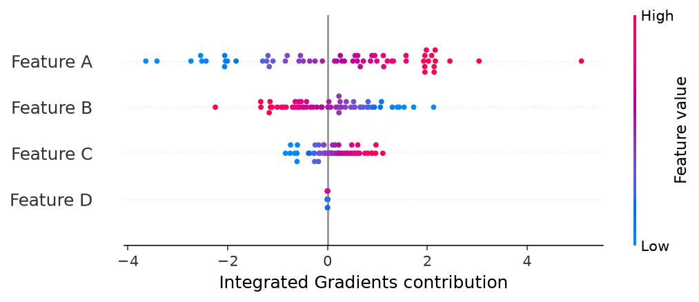
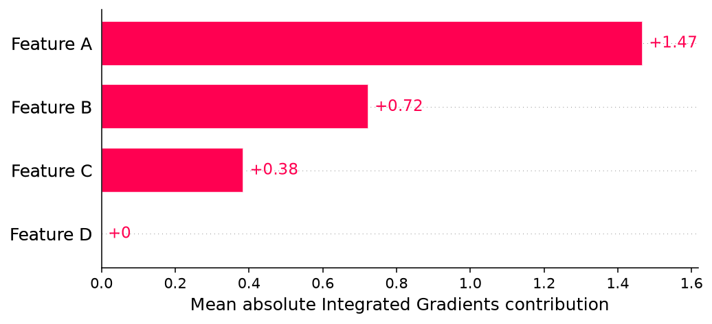
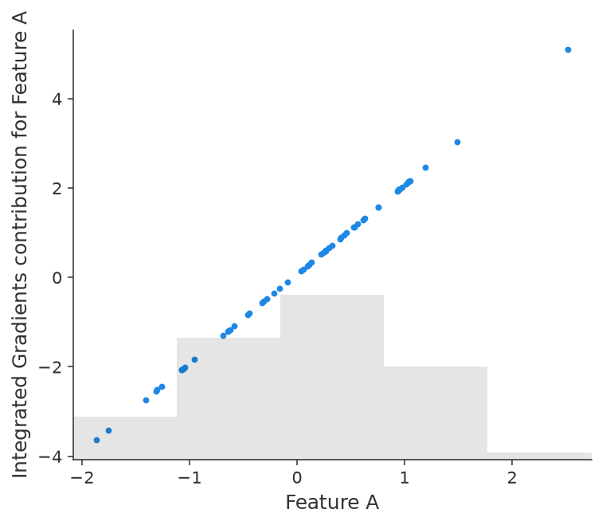

# Plot with SHAP

**Compute attributions with UnifiedIG; visualize them with SHAP.** One conversion
opens a familiar plotting workflow: explain an individual prediction with a
waterfall, inspect a population with a beeswarm, rank contributions with a bar
chart, or explore a feature with a scatter plot.

## From explanation to plot

Install the optional plotting dependency:

```console
python -m pip install "unifiedig[shap]"
```

For an existing scalar tabular explanation, the entire transition is:

```python
import shap

plot_values = explanation.to_shap()
shap.plots.waterfall(plot_values[0])
shap.plots.beeswarm(plot_values)
```

`to_shap()` creates a `shap.Explanation` carrying the calculated feature
contributions, baseline values, input data, and feature/output labels. It does
not run the model again or recompute the attributions. Keep the original
UnifiedIG result to inspect its completeness diagnostics and `attribute_after`
metadata, which are not carried into the SHAP container.

## A complete example

Fit a model, construct a calibrated reference distribution, explain held-out
observations, and convert the result:

```{literalinclude} ../examples/shap_plotting.py
:language: python
:start-after: import matplotlib.pyplot as plt
:end-before: "# End explanation"
```

The
[complete runnable script](https://github.com/LudgerHentschel/unifiedig/blob/main/examples/shap_plotting.py)
generates all four plots below. Feature names are
assigned for this NumPy example; DataFrame column names are carried over by
UnifiedIG automatically.

## Waterfall: explain one observation

```python
shap.plots.waterfall(plot_values[0])
```

Select one row. The plot starts at its baseline output and adds signed feature
contributions to reach the model output. Contributions that raise the output
point in one direction; those that lower it point in the other.



## Beeswarm: inspect a population

```python
shap.plots.beeswarm(plot_values)
```

Pass all evaluation rows. Each point is an observation's contribution for a
feature; color represents the feature value. This shows the direction and
spread of contributions across the population, beyond a single importance
ranking.



## Bar: rank contribution magnitudes

```python
shap.plots.bar(plot_values)
```

For multiple rows, the default bar plot summarizes mean absolute contribution
per feature. It measures magnitude across these observations; signs are lost in
that aggregation. Pass `plot_values[0]` for a single-observation bar plot.
See [SHAP's bar API](https://shap.readthedocs.io/en/latest/generated/shap.plots.bar.html)
for grouping and display options.



## Scatter: relate a feature to its contribution

```python
shap.plots.scatter(plot_values[:, "Feature A"])
```

Select one feature column. The horizontal axis shows its observed values and
the vertical axis shows its contributions. Optionally use
`color=plot_values[:, "Feature B"]` to color by a second feature. See
[SHAP's scatter API](https://shap.readthedocs.io/en/latest/generated/shap.plots.scatter.html).



## Multiclass and multiple outputs

Waterfall and beeswarm examples above expect one scalar output. For a
multiclass explanation, choose a meaningful pairwise score contrast first:

```python
contrast = multiclass_result.contrast(0, 1)
plot_values = contrast.to_shap()
shap.plots.waterfall(plot_values[0])
shap.plots.beeswarm(plot_values)
```

This explains class 0's score minus class 1's score; integers are output
positions and strings can select output names. It requires no new model pass.
Alternatively, select one centered class coordinate or regression output from
the converted explanation with `result.to_shap()[:, :, output_index]` for
tabular data. That explains the selected coordinate, rather than a pairwise
contrast. See [output interpretation](explanations.md).

## Label and save the figures

The values remain **Integrated Gradients contributions**. SHAP supplies the
plotting tools; the conversion does not make them Shapley values. Some SHAP
plot defaults label the axis “SHAP value.” For presentation, use `show=False`
and label the quantity explicitly before saving:

```python
import matplotlib.pyplot as plt

shap.plots.beeswarm(plot_values, show=False)
plt.xlabel("Integrated Gradients contribution")
plt.savefig("ig-beeswarm.png", dpi=160, bbox_inches="tight")
plt.close()
```

For classification, the reconstructed output is a score or margin, not a
probability. For loss attribution, use the appropriate loss units. In the
alternative `loss_reduction` direction, ordinary additive waterfall endpoint
labels do not reconstruct endpoint loss; use the default `loss_change`
direction for a loss waterfall. See [loss attribution](loss.md).

The example gallery uses `show=False` and labels the figures as Integrated
Gradients. Reproduce it with:

```console
python examples/shap_plotting.py --output-dir docs/_static/plots
```
